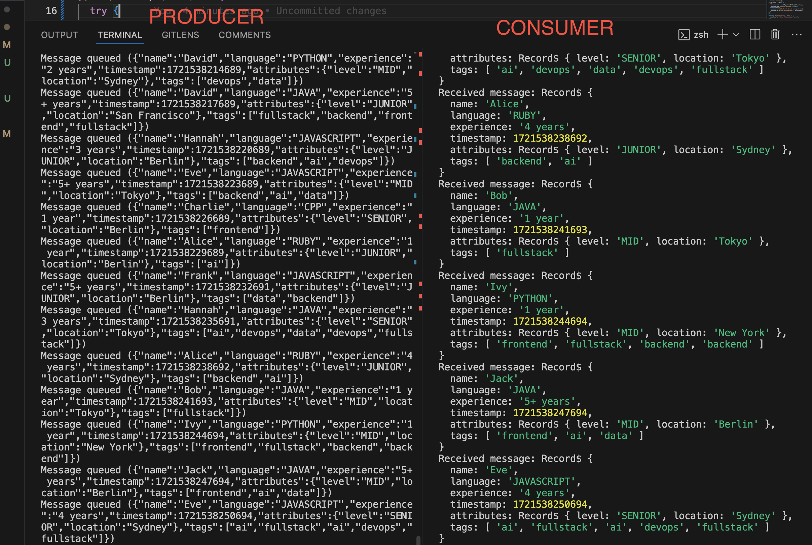

# Kafka Producer-Consumer

This repository contains an example project demonstrating a Kafka producer-consumer setup using Node.js. The producer generates random developer data and sends it to a Kafka topic, while the consumer reads and processes the data from the topic.

## Sample



### Components

1. **Producer**:
   - Creates and sends random developer data to a Kafka topic.
   - Generates data such as developer name, programming language, experience, and attributes.

2. **Kafka**:
   - Acts as a message broker, facilitating communication between the producer and consumer.
   - Stores the messages produced by the producer in a topic.

3. **Consumer**:
   - Reads and processes messages from the Kafka topic.
   - Logs the received developer data.

## Getting Started

### Prerequisites

- Node.js (v16.20.1 or later)
- Docker
- Docker Compose

### Installation

1. **Clone the repository**:
   ```sh
   git clone https://github.com/osamahkenawy/kafka-producer-consumer-nodejs.git
   cd kafka-producer-consumer-nodejs